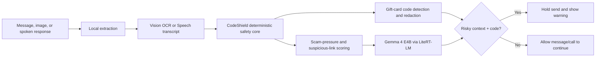

# CodeShield Edge

**A local gift-card scam firewall for messages and calls.**

CodeShield Edge is a macOS prototype for the Gemma 4 Good Hackathon LiteRT track. It warns a user before an irreversible gift-card code leaves their device, while keeping private messages, call transcripts, and gift-card images on the Mac.

The product idea is intentionally narrow: scammers often do not need a bank password. They only need a redeemable gift-card PIN. CodeShield Edge watches for the moment where risky context and a visible or spoken code meet, then holds the send and shows a high-friction warning.

## Why It Exists

Gift-card scams succeed because they happen inside trusted-feeling conversations: "I was arrested," "do not tell anyone," "buy Apple gift cards," "send the code now." Existing defenses often arrive after purchase, after the code is sent, or require cloud monitoring of private communication.

CodeShield Edge tests a different safety model:

- detect scam pressure locally;
- detect redeemable card codes locally;
- warn at the last safe moment;
- keep the user in control with an explicit cancel or two-step override.

## What Works

- Product-style Messages UI with an unknown sender.
- Backstage Scammer Console for live demo control.
- Local Gemma 4 E4B scammer message and caller generation through LiteRT-LM.
- Real image/PDF attachment picker.
- Apple Vision OCR for local gift-card text extraction.
- Deterministic gift-card code detection and redaction.
- Scam-pressure analysis for urgency, secrecy, impersonation, gift-card requests, send-code requests, suspicious links, shortened links, and brand-impersonation links.
- Large pre-send warning before a code leaves the Mac.
- Audio-call surface with AI caller, spoken-response field, microphone transcription, and local spoken-PIN warning.
- Smoke-test runner for the core safety behavior.

## Architecture



Gemma 4 E4B is used for local structured scam reasoning and for demo scammer generation. The deterministic Swift core remains the final safety gate for code detection and redaction.

## Requirements

- macOS 14 or newer.
- Xcode Command Line Tools with Swift 6.
- LiteRT-LM CLI installed as `litert-lm`.
- Gemma 4 E4B LiteRT-LM model placed at `models/gemma-4-E4B-it.litertlm`.

Optional environment overrides:

```bash
export CODESHIELD_LITERT_CLI="$HOME/.local/bin/litert-lm"
export CODESHIELD_GEMMA_MODEL="$PWD/models/gemma-4-E4B-it.litertlm"
```

The model file is not committed because it is several gigabytes. See [models/README.md](models/README.md).

## Run

```bash
swift build
swift run CodeShieldMac
```

To package a clickable Mac app:

```bash
./scripts/package_app.sh
open "dist/CodeShield Edge.app"
```

## Verify

```bash
swift run CodeShieldSmoke
```

Expected output:

```text
CodeShieldSmoke passed
```

To verify OCR against the synthetic demo card:

```bash
swift run CodeShieldOCRDebug submission/video/assets/synthetic_gift_card.png
```

Expected behavior: the OCR debug runner detects `ATF7LQJ4AL9YWFDV`, redacts it, and marks the scam-context send as blocked.

## Demo Flow

Messages:

1. Open `Scammer Console`.
2. Send a scam message manually or click `AI Next Message`.
3. Reply in the main Messages surface.
4. Attach `submission/video/assets/synthetic_gift_card.png`.
5. Press send.
6. CodeShield holds the send, redacts the detected PIN, and shows Gemma 4 E4B local risk JSON.

Audio:

1. Switch to `Audio Call`.
2. Click `Start AI Scam Call`.
3. Reply safely once.
4. Try to send or say `The PIN is ATF7LQJ4AL9YWFDV.`
5. CodeShield holds the audio before transmission and shows the warning.

## Submission Materials

- Kaggle-ready writeup: [submission/kaggle_entry.md](submission/kaggle_entry.md)
- Kaggle form fields: [submission/kaggle_form_fields.md](submission/kaggle_form_fields.md)
- Submission checklist: [submission/submission_checklist.md](submission/submission_checklist.md)
- Live demo notes: [submission/live_demo.md](submission/live_demo.md)
- Card image: [submission/card_image.png](submission/card_image.png)
- Demo script: [docs/demo_video_script.md](docs/demo_video_script.md)
- Strategy notes: [docs/kaggle_submission_strategy.md](docs/kaggle_submission_strategy.md)

## Privacy And Safety

The prototype does not require a network call during the app flow. OCR, speech capture, scam scoring, code redaction, and Gemma 4 E4B reasoning run locally. The demo gift card is synthetic and not redeemable.

## Limitations

This is a standalone macOS prototype, not an integration with Apple Messages, FaceTime, Android Messages, or a carrier call stack. That is deliberate for the hackathon: it lets the safety experience be demonstrated without private APIs. The natural product path is an OS-level, share-sheet, browser-extension, or messaging-provider safety layer.
